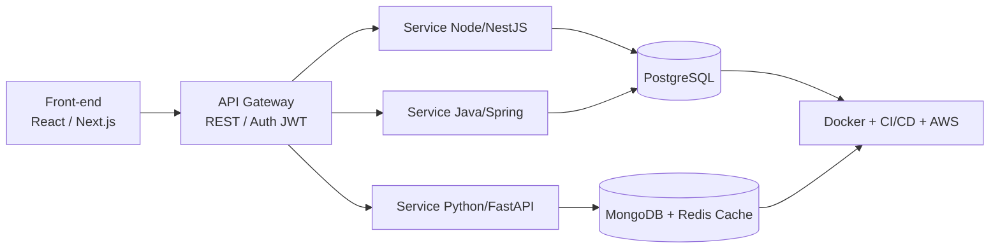

<div align="center">

<!-- BANNER -->


<!-- TYPING -->
<a href="https://github.com/ArthurKyo">
  
</a>

<!-- BADGES -->
<p>
  
  <a href="https://github.com/ArthurKyo?tab=followers"></a>
  
  
</p>

<p>
  <a href="https://www.linkedin.com/in/SEU-LINKEDIN"></a>
  <a href="mailto:SEU-EMAIL"></a>
  <a href="https://SEU-PORTFOLIO"></a>
  <a href="https://discord.com/users/SEU-DISCORD"></a>
</p>

</div>

---

## 🚀 Sobre mim | About me

> **PT-BR:** Sou Desenvolvedor **Full-Stack** focado em construir sistemas completos, performáticos e escaláveis — do banco de dados à interface. Especialista em **Back-end (APIs, microsserviços, regras de negócio)** e **Front-end (SPAs modernas, responsivas e acessíveis)**, com forte base em **Banco de Dados relacionais e NoSQL**, autenticação, testes e deploy.
>
> **EN:** I'm a **Full-Stack Developer** focused on building complete, performant and scalable systems — from database to UI. Specialized in **Back-end (APIs, microservices, business logic)** and **Front-end (modern, responsive, accessible SPAs)**, with strong background in **SQL & NoSQL Databases**, auth, testing and deployment.

```typescript
const arthur: FullStackDeveloper = {
  name: "Arthur Pereira da Costa",
  username: "ArthurKyo",
  role: "Full-Stack Developer",
  focus: ["Back-end", "Front-end", "Databases", "System Design"],
  backend: ["Node.js", "NestJS", "Java + Spring Boot", "Python + FastAPI"],
  frontend: ["TypeScript", "React", "Next.js", "TailwindCSS"],
  databases: ["PostgreSQL", "MySQL", "MongoDB", "Redis"],
  devops: ["Docker", "GitHub Actions", "AWS", "Nginx"],
  practices: ["Clean Architecture", "SOLID", "TDD", "REST & Microservices"],
  currentlyLearning: ["System Design avançado", "Kubernetes", "AWS Solutions Architect"],
  openToWork: true
};
```

### 🎯 O que eu faço bem | What I do best

| Área | Skills |
|------|--------|
| **Back-end** | APIs REST escaláveis, autenticação JWT/OAuth2, microsserviços, filas, cache, validações, logs, testes unitários + integração |
| **Front-end** | React + Next.js, TypeScript, Tailwind, formulários, dashboards, consumo de APIs, SEO, responsividade, acessibilidade |
| **Banco de Dados** | Modelagem relacional, índices, transactions, migrations (Prisma/TypeORM/Flyway), MongoDB aggregation, Redis cache |
| **DevOps & Qualidade** | Docker & Compose, CI/CD GitHub Actions, lint + husky, Jest/Vitest/JUnit/Pytest, documentação OpenAPI/Swagger |

---

## 🛠️ Tech Stack

<div align="center">

### Languages
[](https://skillicons.dev)

### Back-end
[](https://skillicons.dev)

### Front-end
[](https://skillicons.dev)

### Databases & Messaging
[](https://skillicons.dev)

### Tools & Cloud
[](https://skillicons.dev)

</div>

<details>
<summary><b>📊 Matriz de proficiência (clique para expandir)</b></summary>
<br>

| Tech | Nível | Uso |
|------|-------|-----|
| TypeScript / Node / NestJS | ████████░░ 80% | APIs, microsserviços |
| React / Next.js / Tailwind | ████████░░ 80% | SPAs, dashboards, e-commerce |
| Java / Spring Boot | ███████░░░ 70% | APIs enterprise, JPA/Hibernate |
| Python / FastAPI | ███████░░░ 70% | APIs rápidas, automações, dados |
| PostgreSQL / MySQL | ████████░░ 80% | Modelagem, otimização, migrations |
| MongoDB / Redis | ███████░░░ 70% | Documentos, cache, sessões |
| Docker / CI-CD / AWS | ██████░░░░ 60% | Deploy, pipelines |

</details>

---

## 📈 GitHub Analytics

<div align="center">


<br/>


<br/>


<br/>


</div>

---

## 📌 Projetos em Destaque | Featured Projects

> Fixe (pin) estes 6 repositórios no seu perfil. Templates prontos na pasta [`/projects`](./projects).

| Projeto | Descrição PT / EN | Stack | Status |
|---------|-------------------|-------|--------|
| [⚡ thunder-store](https://github.com/ArthurKyo/thunder-store) | E-commerce full-stack com dashboard admin, checkout, pagamentos e cache. <br/>*Full-stack e-commerce with admin dashboard, checkout & caching.* | Next.js • NestJS • PostgreSQL • Redis • Docker | 🚧 Em construção |
| [🔐 auth-api-multistack](https://github.com/ArthurKyo/auth-api-multistack) | API de autenticação comparando Node vs Java vs Python (JWT, refresh, RBAC). <br/>*Auth API comparing 3 back-ends.* | NestJS • Spring Boot • FastAPI • Postgres | 💡 Planejado |
| [📊 dashboard-sales](https://github.com/ArthurKyo/dashboard-sales) | Dashboard de vendas com gráficos, filtros e export CSV. <br/>*Sales dashboard with charts & filters.* | React • TypeScript • Recharts • Node | 💡 Planejado |
| [💬 realtime-chat](https://github.com/ArthurKyo/realtime-chat) | Chat realtime com WebSockets, salas e histórico. <br/>*Realtime chat with rooms & history.* | Next.js • Socket.io • MongoDB • Redis | 💡 Planejado |
| [🧠 system-design-notes](https://github.com/ArthurKyo/system-design-notes) | Estudos de arquitetura, SQL vs NoSQL, padrões. <br/>*Architecture & DB study notes.* | Markdown • Diagrams • SQL | 📚 Contínuo |
| [🐳 fullstack-docker-template](https://github.com/ArthurKyo/fullstack-docker-template) | Template full-stack com CI/CD pronto. <br/>*Production-ready full-stack starter.* | Docker • GH Actions • Nginx • AWS | 🛠️ Template |

<div align="center">



</div>

---

## 🏗️ Como eu construo um projeto (meu padrão profissional)

1. **Descoberta:** requisitos, casos de uso, DER + diagrama de arquitetura
2. **Back-end:** modelagem DB → migrations → API REST documentada (Swagger) → auth + validações → testes
3. **Front-end:** design system + Tailwind → páginas responsivas → integração API com tratamento de erro/loading
4. **Qualidade:** ESLint + Prettier + Husky, Jest/Vitest, cobertura >70%
5. **Deploy:** Dockerfile + Compose, GitHub Actions CI/CD, variáveis de ambiente, README profissional

Cada repo meu segue: `README com demo + stack + como rodar + arquitetura + roadmap + licença`.

---

## 🎓 Formação & Certificações | Learning Journey

- [x] Lógica, POO, Estrutura de Dados
- [x] Back-end: APIs REST, JPA/Hibernate, Prisma/TypeORM
- [x] Front-end: React, Next.js, TailwindCSS
- [x] Bancos: PostgreSQL, MySQL, MongoDB, Redis — modelagem & tuning
- [ ] AWS Certified Developer / Docker & Kubernetes (em progresso)
- [ ] System Design & Microsserviços avançado

---

## 🤝 Vamos nos conectar? | Let's connect!

<div align="center">

Troque `SEU-LINKEDIN`, `SEU-EMAIL` e `SEU-PORTFOLIO` pelos seus links reais.

<a href="https://www.linkedin.com/in/SEU-LINKEDIN"></a>
<a href="mailto:SEU-EMAIL"></a>
<a href="https://SEU-PORTFOLIO"></a>

**Aberto a freelas, estágios e junior dev full-stack. Open to freelance & junior full-stack roles.**


</div>
